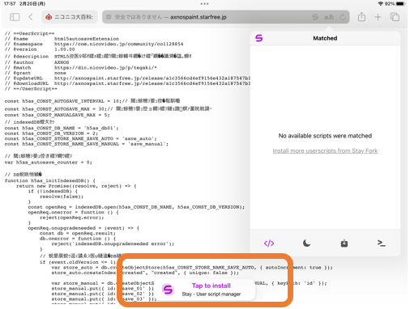

## インストール方法 - Mac,iPad環境

### ＜STEP1＞ 拡張機能「Stay2」のインストール

MacOS/iPadの方は「Tampermonkey」のダウンロードが有料($1.99)のため、代替として「Stay2」をインストール（無料）してください。
※「Tampermonkey」を既に使用されている方は「Stay2」を使用せず「Tampermonkey」でスクリプトを動作させることもできます。

* [App Store「Stay2」インストールページ](https://apps.apple.com/jp/app/stay-2-userscript-extension/id1591620171)

### ＜STEP2＞ 「自動バックアップ拡張ユーザースクリプト」のインストール
iPad + Safariの例で説明を行います。

1. ブラウザの「機能拡張を管理」を選択し「Stay」を有効にする
   * 
   * 

2. 以下のリンク先へ飛ぶ
   * <a href="https://github.com/axnospaint/test/raw/main/axnospaint_tks.user.js" target="_blank">[ AXNOS Paint ユーザースクリプト ]</a>

3. 「Stay」を実行し、アクセスを許可「常に許可」→「このWebサイトで常に許可」
   * 
   * 

4. 画面下の「Tap to install」をタップ
   * 

5. 画面右上の「作成」をタップ
   * 

6. ライブラリに「AXNOS_Paint_UserScript」が「アクティブ化」の状態で登録されていれば準備完了
   * 

