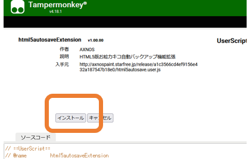
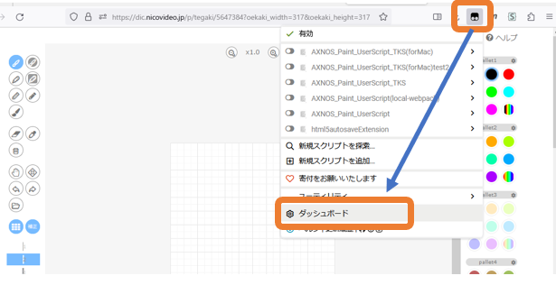
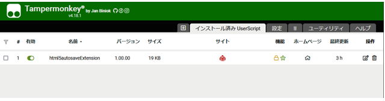

## インストール方法 - Windows環境

### ＜STEP1＞ 拡張機能「Tampermonkey」のインストール

使用しているブラウザに応じて、以下のリンク先の導入ページへ飛び「Tampermonkey」（ユーザースクリプト実行環境）をインストール（無料）してください。

* [Google Chromeを使用している方](https://chrome.google.com/webstore/detail/tampermonkey/dhdgffkkebhmkfjojejmpbldmpobfkfo?hl=ja)
* [Firefoxを使用している方](https://addons.mozilla.org/ja/firefox/addon/tampermonkey/)
* [Microsoft Edgeを使用している方](https://microsoftedge.microsoft.com/addons/detail/tampermonkey/iikmkjmpaadaobahmlepeloendndfphd)
* [その他のブラウザは公式ページへ](https://www.tampermonkey.net/)

### ＜STEP2＞ 「自動バックアップ拡張ユーザースクリプト」のインストール

1. 以下のリンクへ飛ぶ
  * <a href="https://github.com/axnospaint/test/raw/main/axnospaint_tks.user.js" target="_blank">[ AXNOS Paint ユーザースクリプト ]</a>

2. 「インストール」ボタンをクリック（画面が表示されない場合はSTEP1を再確認）
  * 

3. ブラウザの「Tampermonkey」アイコンをクリックし、ダッシュボードを選択
  * 

4. インストール済みUserScriptに「html5autosaveExtension」が「有効」の状態で登録されていれば準備完了
  * 

## 備考
「Tampermonkey」を使用していると、突然、寄付を要求する画面が表示されることがあります。寄付の意思がなければ「貢献したくありません」を選択してください。（特には不具合は発生しません）